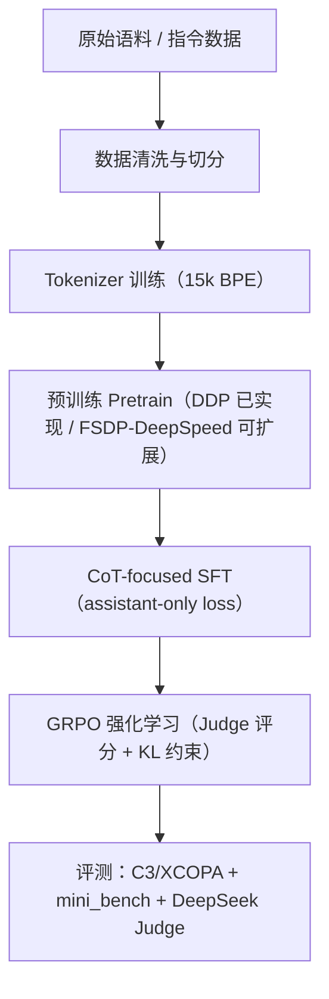

# 🧠 智愈·Baymax-LLM
> **从零构建：探索稠密架构大模型的极限性能**


---

## ✨ 项目亮点（Highlights）

- **全链路复现**：从原始数据清洗 → Tokenizer 训练 → 分布式预训练 → CoT 定向 SFT → GRPO 强化学习，全流程可复现。
- **逻辑推理增强**：SFT 阶段采用 *assistant-only loss*，并围绕 `<think>...</think>` 思维链格式构建推理样本。
- **强化学习前沿**：内置 GRPO 训练范式，结合 Judge 评估（fluency / factuality / instruction_following）进行偏好优化。
- **工程可扩展**：支持 DDP、多卡、梯度累积、混合精度、KV Cache、Flash Attention、torch.compile 等工程优化策略。

---

## 🧱 技术架构（Architecture）

### ✅ 模型核心特性
- **Decoder-only Transformer（类 Qwen3-dense）**
- **RoPE 旋转位置编码**（支持长上下文）
- **RMSNorm + Pre-Norm 结构**
- **SwiGLU 激活函数**
- **GQA（Grouped Query Attention）**
- **权重共享（Embedding ↔ LM Head）**
- **Flash Attention（PyTorch SDPA）**

### 🗺️ 训练全生命周期（Mermaid）



---

## 📐 关键配置（默认）

| 模块 | 默认配置 | 说明 |
|---|---|---|
| Hidden Size | 768 | 0.1B 级别默认实验配置 |
| Layers | 12 | Pre-Norm Transformer |
| Heads / KV Heads | 12 / 4 | GQA |
| FFN | 2048 | SwiGLU |
| Vocab | 15,000 | BPE + 15 特殊 Token |
| Max Position | 32,768 | RoPE |
| 精度 | bf16 / fp16 | 训练可切换 |

> ⚠️ **说明**：仓库默认配置为 `0.1B` 级别；**7B 规模为可扩展设计目标**，见下方预训练策略说明。

---

## 🧪 训练阶段详情（Stages）

### 1) 预训练 Pre-training
- **数据格式**：JSONL → 预处理为 `.bin` + `.meta`，使用 `memmap` 高效加载
- **优化策略**：DDP、梯度累积、学习率 warmup、梯度裁剪
- **评测**：C3 / XCOPA（中英推理）

**7B 规模建议方案（规划性说明）**  
| 规模 | Token 量级 | 数据配比示例 | 分布式策略 |
|---|---|---|---|
| 7B 目标 | ~2T Tokens | 中英混合 + 推理强化 | FSDP / DeepSpeed ZeRO-3 |

---

### 2) 微调 SFT（CoT-focused）
- **格式**：多轮对话 JSONL
- **监督目标**：仅计算 assistant token loss（抑制噪声、聚焦生成质量）
- **评测**：mini_bench + DeepSeek Judge（异步评价）

---

### 3) 强化学习 RLHF（GRPO / PPO 方向）
- **当前实现**：GRPO（Group Relative Policy Optimization）
- **奖励构成**：
  - 格式检查 `<think>\n...\n</think>\n...`（不符合直接 0 分）
  - Judge 三指标均值（fluency / factuality / instruction_following）
- **策略优化**：参考模型 KL 约束 + 优势归一化
- **PPO 方向**：接口设计已兼容，可作为后续扩展目标

---

## ⚡ Quick Start（推理演示）

```python
import torch
from transformers import AutoTokenizer
from model.config import SpongeBobConfig
from model.model_spongebob_pro import SpongeBobForCausalLM

tokenizer = AutoTokenizer.from_pretrained("./tokenizer_15k")

model = SpongeBobForCausalLM(SpongeBobConfig(
    hidden_size=768,
    num_hidden_layers=12
))
state_dict = torch.load("path/to/sft_768.pth", map_location="cpu")
model.load_state_dict(state_dict, strict=False)
model.eval()

messages = [{"role": "user", "content": "请用三句话解释牛顿第二定律"}]
prompt = tokenizer.apply_chat_template(messages, tokenize=False, add_generation_prompt=True)
inputs = tokenizer(prompt, return_tensors="pt")

with torch.no_grad():
    output_ids = model.generate(
        inputs["input_ids"],
        attention_mask=inputs["attention_mask"],
        max_new_tokens=256,
        top_p=0.7,
        temperature=0.2
    )

print(tokenizer.decode(output_ids[0], skip_special_tokens=False))
```

也可直接使用交互脚本：
```bash
python eval.py --model_path path/to/sft_768.pth --tokenizer_path ./tokenizer_15k --model_type sft
```

---

## 📊 可视化占位（请替换为你的实验结果）
- Loss 曲线  
  

- 显存占用  
  

---

## 📝 面试加分项：思考与感悟（Reflections）

> **开发者手记**  
在全链路训练过程中，最难的不是“能跑起来”，而是“长期稳定地跑下去”。  
我重点关注了三类问题：  
1) **Loss 突刺**：通过 warmup + 梯度裁剪 + 监控 KL 波动来控制训练稳定性；  
2) **显存优化**：在小显存环境下，结合梯度累积、混合精度与 KV cache，尽可能扩大 batch 与上下文；  
3) **偏好对齐**：GRPO 的格式约束与 Judge 评分相结合，使得模型在“有逻辑的输出”与“遵循指令”之间达成更均衡的优化方向。  

我的目标不仅是训练一个“会说话的模型”，而是训练一个**具有结构化推理能力**、可被系统性评价的模型。

---

## 📎 项目结构（核心文件）

```
Baymax-PRO/
├─ model/                # 模型结构（RMSNorm / RoPE / SwiGLU / GQA）
├─ train/                # pretrain / sft / grpo 训练脚本
├─ dataset/              # pretrain / sft / grpo 数据集封装
├─ tokenizer_15k/        # 15k BPE Tokenizer
├─ benchmark/            # C3/XCOPA/mini_bench 评测
└─ eval.py               # 交互式推理
```

---

## 🙏 鸣谢与引用

- Qwen / Qwen3 开源社区（稠密架构与工程范式启发）
- DeepSeek 社区（Judge 评测与对齐策略启发）
- PyTorch / Transformers 社区（训练与推理生态）
