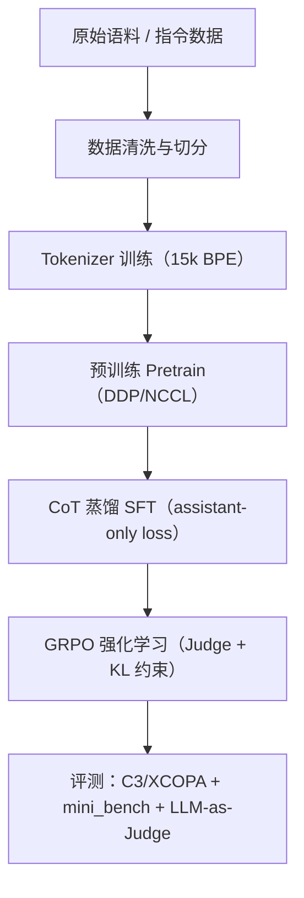
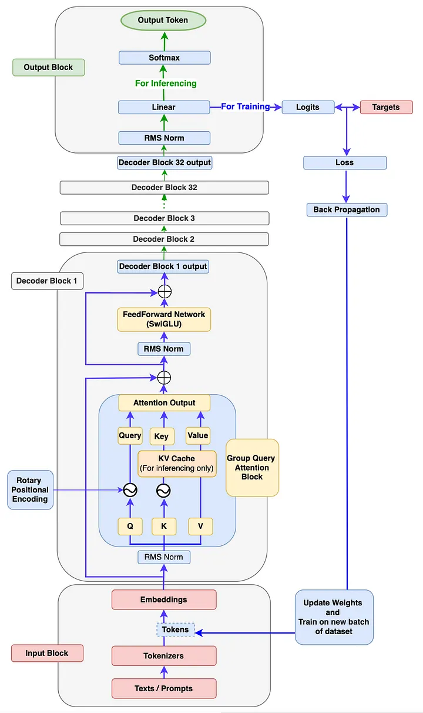
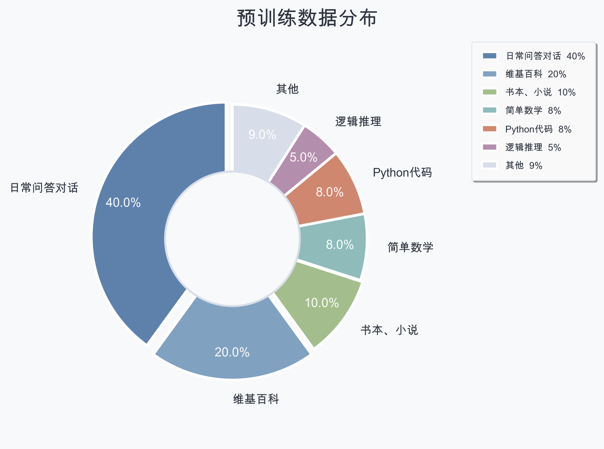
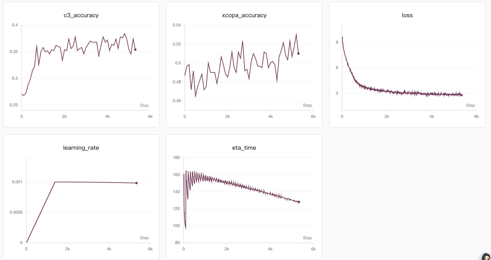
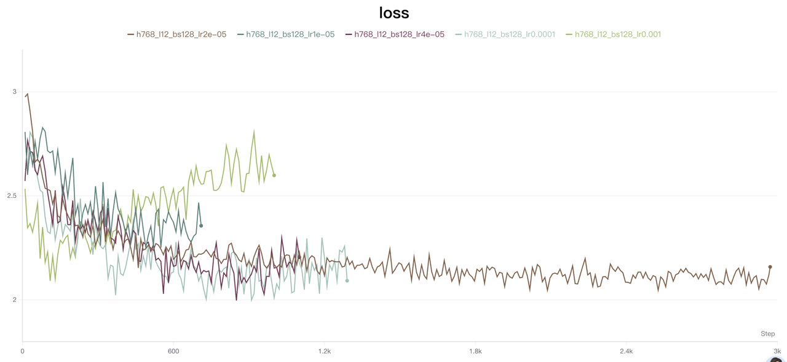
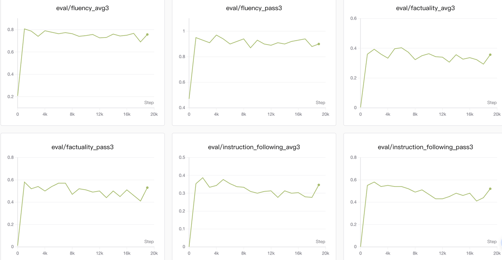
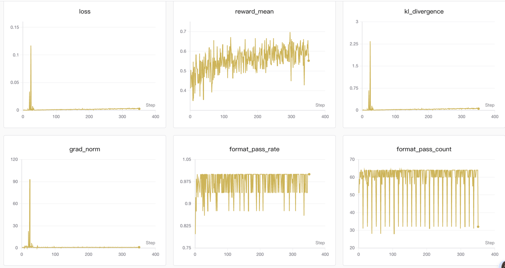
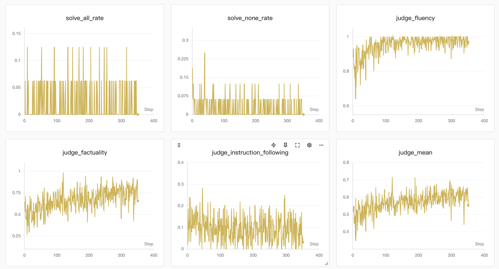

<p align="center">
  
</p>

# 🧽 Baymax PRO
> **从零构建：稠密架构、思维链蒸馏与强化学习的可复现工程**

"Hello, I am Baymax."

(●—●)大白(Baymax)的灵魂源于那枚红色的芯片，而大模型的生命始于第一行代码。
本项目是我对 AGI 最纯粹的一次从零探索：从随机初始化到逻辑涌现，赋予稠密架构（Dense）以理性的温度。
从零开始，构建属于我的人工智能初心。


---

## 🎯 项目定位

本项目严格依据两份项目文档实现，并做了阶段整合：
- **项目 A（SpongeBobPro）**：预训练 + SFT（从 0 到 1 的训练框架）。
- **项目 B（SpongeBobR1）**：思维链蒸馏 + GRPO 强化学习。
- **阶段合并**：项目 A 的 SFT 与项目 B 的 CoT 蒸馏合并为一个阶段，因此最终形成 **三阶段链路**：  
**Pretrain → CoT-distill SFT → RL(GRPO)**。

---

## 🧭 总览

项目全流程如下（见下方流程图与可视化示例）。

---

## ✨ 项目亮点（Highlights）

- **全链路复现**：原始数据清洗 → Tokenizer 训练 → DDP 预训练 → CoT 蒸馏 SFT → GRPO 强化学习。
- **工程自研**：手写模型结构与训练循环，包含 RMSNorm / RoPE / GQA / SwiGLU / KV Cache。
- **推理能力增强**：SFT 阶段只计算 assistant token loss，并以 `<think>...</think>` 约束思维链。
- **强化学习对齐**：GRPO 引入格式检查 + LLM-as-Judge（fluency/factuality/instruction-following）评价。

---

## 🧱 技术架构（Architecture）

### ✅ 模型核心特性
- **Decoder-only Transformer（类 Qwen3 Dense）**
- **RoPE 旋转位置编码（支持 32K）**
- **RMSNorm + Pre-Norm 结构**
- **SwiGLU 激活函数**
- **GQA（12 Q 头 / 4 KV 头）**
- **权重共享（Embedding ↔ LM Head）**
- **Flash Attention（PyTorch SDPA）**

### 🗺️ 训练全生命周期（Mermaid）



---

## 🖼️ 可视化与图表














---

## 📐 关键配置（默认）

| 模块 | 默认配置 | 说明 |
|---|---|---|
| Hidden Size | 768 | 0.1B 级别默认实验配置 |
| Layers | 12 | Pre-Norm Transformer |
| Heads / KV Heads | 12 / 4 | GQA |
| FFN | 2048 | SwiGLU |
| Vocab | 15,000 | BBPE + 15 特殊 Token |
| Max Position | 32,768 | RoPE |
| 精度 | bf16 / fp16 | 训练可切换 |

> ⚠️ **说明**：仓库默认配置为 `0.1B` 级别；**7B Token 级语料规模**来自文档规划与复现流程。

---

## 🧪 训练阶段详情（三阶段）

### 1) 预训练 Pre-training
- **数据处理**：JSONL → `.bin` + `.meta`，`memmap` 加载，低内存可扩展。
- **训练策略**：DDP + NCCL，多卡、混合精度、梯度累积、warmup-cosine 调度。
- **评测**：C3 / XCOPA 推理 benchmark。

**效果快照（示例）**
| 指标 | 初期 | 收敛后 |
|---|---|---|
| Loss | ~8.0 | ~2.3 |
| C3 | ~0.25 | ~0.40 |
| XCOPA | ~0.55 | ~0.55+ |


---

### 2) CoT 蒸馏 SFT（合并阶段）
- **数据规模**：2M+ 条指令对话数据。
- **监督目标**：只计算 assistant token loss（对用户指令部分 mask）。
- **CoT 模式**：通过 `<think>...</think>` 规范思维链输出格式。
- **评测**：mini_bench + DeepSeek Judge 异步评估。


---

### 3) 强化学习 RL（GRPO）
- **奖励机制**：
  - 格式检查：`<think>\n...\n</think>\n...` 不合规直接 0 分。
  - Judge 三维度评分：fluency / factuality / instruction_following。
- **优化细节**：参考模型 KL 约束 + 优势归一化。
- **日志追踪**：reward 均值、格式通过率、KL、梯度范数等指标。


---

## ⚡ Quick Start（推理演示）

```python
import torch
from transformers import AutoTokenizer
from model.config import SpongeBobConfig
from model.model_spongebob_pro import SpongeBobForCausalLM

tokenizer = AutoTokenizer.from_pretrained("./tokenizer_15k")

model = SpongeBobForCausalLM(SpongeBobConfig(
    hidden_size=768,
    num_hidden_layers=12
))
state_dict = torch.load("path/to/sft_768.pth", map_location="cpu")
model.load_state_dict(state_dict, strict=False)
model.eval()

messages = [{"role": "user", "content": "请用三句话解释牛顿第二定律"}]
prompt = tokenizer.apply_chat_template(messages, tokenize=False, add_generation_prompt=True)
inputs = tokenizer(prompt, return_tensors="pt")

with torch.no_grad():
    output_ids = model.generate(
        inputs["input_ids"],
        attention_mask=inputs["attention_mask"],
        max_new_tokens=256,
        top_p=0.7,
        temperature=0.2
    )

print(tokenizer.decode(output_ids[0], skip_special_tokens=False))
```

也可直接使用交互脚本：
```bash
python eval.py --model_path path/to/sft_768.pth --tokenizer_path ./tokenizer_15k --model_type sft
```

---

## 📎 项目结构（核心文件）

```
Baymax-PRO/
├─ model/                # 模型结构（RMSNorm / RoPE / SwiGLU / GQA）
├─ train/                # pretrain / sft / grpo 训练脚本
├─ dataset/              # pretrain / sft / grpo 数据集封装
├─ tokenizer_15k/        # 15k BPE Tokenizer
├─ benchmark/            # C3/XCOPA/mini_bench 评测
└─ eval.py               # 交互式推理
```

---

## 📝 工程思考与复盘

> **开发者手记**  
全链路训练的关键不在“能跑”，而在“稳定、可复现、可解释”。  
我重点解决了三类问题：  
1) **Loss 突刺**：warmup + 梯度裁剪 + KL 监控，稳定长程训练；  
2) **显存优化**：混合精度、梯度累积与 KV Cache 协同；  
3) **对齐策略**：格式约束 + Judge 打分，确保可解释的偏好优化。  

我的目标不仅是训练一个模型，而是搭建一条**可复现、可追溯、可解释的研究级训练链路**。

---

## 🙏 鸣谢与引用

- Qwen / Qwen3 开源社区（稠密架构与工程范式启发）
- DeepSeek 社区（Judge 评测与对齐策略启发）
- PyTorch / Transformers 社区（训练与推理生态）
